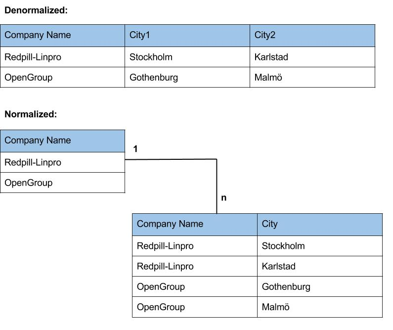
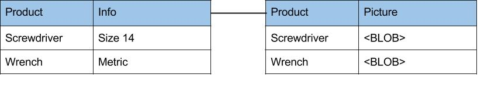

### 前言

数据的持久性/存储是任何Java企业应用的一个关键部分，比如第一个版本的Java发布，JDBC就作为JDK的一部分。大多数读者肯定同意，通常情况下，数据持久化是自己应用的瓶颈所在，但不幸的是，找出问题的根源不是一个简单的事情，需要调查在许多领域，这包括SQL语句，用于执行SQL语句的接口或框架，数据库本身的配置，底层网络传输环境，硬件设备等。所以如何调优 WildFly 数据持久层是一个很范的话题，我主要从以下三个方面去探讨这个话题：

* 数据库设计的一些基本原。如果您的数据设计没有遵循一些普遍被大家认同的原则，那您的应用很有可能会遇到性能问题

* JDBC API。Java 企业应用通过JDBC和相对应数据库提供商提供的数据库驱动去连接数据库

* JPA/Hibernate。WildFly 数据持久使用JPA/Hibernate

### 设计一个好的数据库

尽管当前趋势是将数据库的设计简单化，例如使用Hibernate可以自动完成数据库的设计，这样其实存在着分险，一旦数据库设计不合理，应用实现完成，重构数据库的设计会造成很大的工作量。

数据库设计的一些基本原则有数据库标准化设计(normalization)，数据库分区(partitioning)，合理的索引(good indexing)，早期的性能测试等。

#### 数据库的标准化和非标准化设计（Database normalization and denormalization）

One fundamental cornerstone of database design is normalization. Its purpose is to eliminate redundant data and support data integrity. 如下图

如上图：

* normalized 的版本允许在不修改表结构的前提下添加更多的city
* normalized 的版本有利于表的更新和插入等写操作，denormalized 的版本有利于读操作，通常考虑是 normalization 先于 denormalization。
* 早期性能测试如果需要denormalization设计，可以根据性能测试结果设计。基于JPA/Hibernate的设计@Embedded可以实现底层denormalization设计。

#### 数据库的分块设计（Database partitioning）

另一个数据库设计的原则是数据的分块设计，例如当一个表中有数以亿计的数据条目时，就应该考虑分块设计的原则。通常数据库提供商就提供这种支持，但从数据库的设计角度，分块可以是水平分块和垂直分块。

水平分块是将一个表分割成几个小表，如下图

如上，我们将Event表水平分割成Event 2013和Event 2014，这样最大的优点是有利于查询操作，这样性能方面的优势是：

* 查询速度快，和查询有数以亿计的数据条目的大表相比，查询一个小表性能有显著的提升

* 消耗内存小，查询小表时索引占用内存小

垂直分块是指根据列将大表分割成多个小表，分割后的每个小表和大表有同样多的行数。通常如果一个表中的某列为text或blob，我们可以考虑将其单独分割开，如下图为一垂直分块的示例：

如上，垂直分块好处有：

* 查询速度加快，和分割前大表相比查询更精确

* 应用层如果使用JPA/Hibernate映射配置，一对多关系懒加载可以提升性能。

#### 使用索引

 
