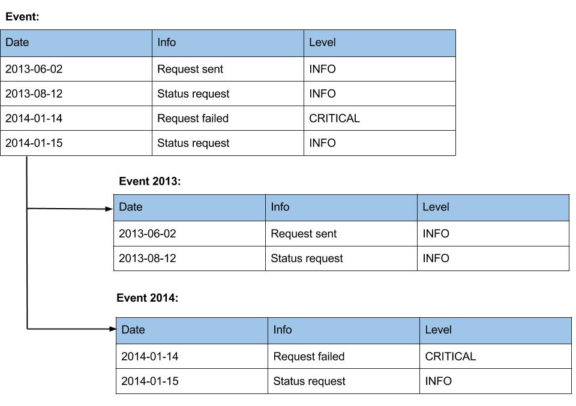

### 前言

数据的持久性/存储是任何Java企业应用的一个关键部分，比如第一个版本的Java发布，JDBC就作为JDK的一部分。大多数读者肯定同意，通常情况下，数据持久化是自己应用的瓶颈所在，但不幸的是，找出问题的根源不是一个简单的事情，需要调查在许多领域，这包括SQL语句，用于执行SQL语句的接口或框架，数据库本身的配置，底层网络传输环境，硬件设备等。所以如何调优 WildFly 数据持久层是一个很范的话题，我主要从以下三个方面去探讨这个话题：

* 数据库设计的一些基本原。如果您的数据设计没有遵循一些普遍被大家认同的原则，那您的应用很有可能会遇到性能问题

* JDBC API。Java 企业应用通过JDBC和相对应数据库提供商提供的数据库驱动去连接数据库

* JPA/Hibernate。WildFly 数据持久使用JPA/Hibernate

### 设计一个好的数据库

尽管当前趋势是将数据库的设计简单化，例如使用Hibernate可以自动完成数据库的设计，这样其实存在着分险，一旦数据库设计不合理，应用实现完成，重构数据库的设计会造成很大的工作量。

数据库设计的一些基本原则有数据库标准化设计(normalization)，数据库分区(partitioning)，合理的索引(good indexing)，早期的性能测试等。

#### 数据库的标准化和非标准化设计（Database normalization and denormalization）

One fundamental cornerstone of database design is normalization. Its purpose is to eliminate redundant data and support data integrity. 如下图

如上图：

* normalized 的版本允许在不修改表结构的前提下添加更多的city
* normalized 的版本有利于表的更新和插入等写操作，denormalized 的版本有利于读操作，通常考虑是 normalization 先于 denormalization。
* 早期性能测试如果需要denormalization设计，可以根据性能测试结果设计。基于JPA/Hibernate的设计@Embedded可以实现底层denormalization设计。

#### 数据库的分块设计（Database partitioning）

另一个数据库设计的原则是数据的分块设计，例如当一个表中有数以亿计的数据条目时，就应该考虑分块设计的原则。通常数据库提供商就提供这种支持，但从数据库的设计角度，分块可以是水平分块和垂直分块。

水平分块是将一个表分割成几个小表，如下图

如上，我们将Event表水平分割成Event 2013和Event 2014，这样最大的优点是有利于查询操作，这样性能方面的优势是：

* 查询速度快，和查询有数以亿计的数据条目的大表相比，查询一个小表性能有显著的提升

* 消耗内存小，查询小表时索引占用内存小

垂直分块是指根据列将大表分割成多个小表，分割后的每个小表和大表有同样多的行数。通常如果一个表中的某列为text或blob，我们可以考虑将其单独分割开，如下图为一垂直分块的示例：

如上，垂直分块好处有：

* 查询速度加快，和分割前大表相比查询更精确

* 应用层如果使用JPA/Hibernate映射配置，一对多关系懒加载可以提升性能。

#### 使用索引

使用索引的主要目的是加快查询，即数据库读速度。尽管索引是快速查询所不可缺少的，但是创建索引同样有一些缺陷，比如数据库表中某一行的更新都需要对相应的索引做更新，数据库表中新数据的插入都需要创建想对应的索引，这样索引带来的缺陷是影响数据库写操作，如下是一些创建使用索引的建议：

* 最多四或五个索引，通常一张表最多创建的索引不要多于四或五个

* 选择合适的列创建索引，比如WHERE查询所对应的列

* 确保索引列为小数据，基于IO操作考虑，小的索引较容易处理，比如选择整数列创建索引

* 选择数据唯一的列，创建索引的列不应该有多个相同的数据，索引列数据应该是唯一的

* 组合索引列顺序，如果创建一个组合索引，列的顺序非常重要，选择数据唯一的列为第一列。

通常为了研究索引是否创建的有效，许多数据库提供上支持一下分析方式，例如在PostgreSQL或Oracle数据库提供EXPLAIN来分析查询语句如下：

~~~
EXPLAIN SELECT * FROM product WHERE family=13; 
~~~ 

WildFly用户使用JPA/Hibernate可以创建索引，例如如下创建一组合索引：

~~~
@Table(appliesTo="tableName", indexes = {
    @Index(name="index1",
        columnNames={"column1","column2"})})
~~~

### JDBC 调优

我们主要从以下三个方面去探讨JDBC 调优：

* 使用数据库连接池多次使用创建的数据库连接

* 确保使用合适的JDBC属性，例如选取合适的fetch size 和 batch size

* 使用Prepared statement

#### 数据库连接池

连接池如何配置需要依赖相关的性能测试，根据性能测试结果配置适合自己的连接池属性。这里我们主要说WrappedConnectionJDK7，从编程API的角度去说，WildFly数据库连接池提供的数据库连接是对JDBC connection的一个封装org.jboss.jca.adapters.jdbc.jdk7.WrappedConnectionJDK7。

配置datasource连接Oracle数据库，我们可以通过以下代码测试数据库连接：

~~~
Connection conn = datasource.getConnection();
WrappedConnectionJDK7 wrappedConn = (WrappedConnectionJDK7)conn;
Connection underlyingConn = wrappedConn.getUnderlyingConnection();
OracleConnection oracleConn = (OracleConnection)underlyingConn;
~~~

#### 使用合适的JDBC fetch size 和 batch size

The fetch size is the number of rows physically retrieved from the database at one time by the JDBC driver as you scroll through a ResultSet with the next() method. If you set the query fetch size to 100, when you retrieve the first row, the JDBC driver retrieves at once the first 100 rows (or all of them if fewer than 100 rows satisfy the query). When you retrieve the second row, the JDBC driver merely returns the row from the local memory; it doesn't have to retrieve that row from the database. This feature improves performance by reducing the number of calls (which are frequently network transmissions) to the database.

To set the query fetch size, use the setFetchSize() method on the Statement (or PreparedStatement or CallableStatement) before execution. The optimal fetch size is not always obvious. Usually, a fetch size of one half or one quarter of the total expected result size is optimal. As a general rule, setting the query fetch size is mostly effective for a large result set. If you set the fetch size much larger than the number of rows retrieved, it's likely that you'll get a performance decrease, not an increase. The default value differs from different database vendors.

In situations where you want to issue several inserts or updates in the same unit of work, update batching lets you to group those statements together and transmit them to the database as one set of instructions. Like setting the query fetch size, update batching works by reducing the number of network transmissions between the application and the database.

#### 使用Prepared statement

PreparedStatement ps = conn.prepareStatement("SELECT a,b FROM t WHERE c = ?");
