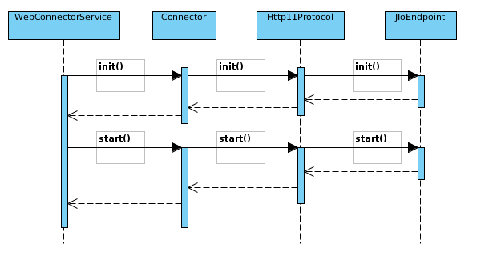

# JBossWeb/Tomcat 中怎样理解 connectionTimeout

如上图给出的是 JBossWeb 初始化一个 Connector 的过程，我们通过此图给出一些相关的源码来阐述如何理解 connectionTimeout。

### Http11Protocol

Connector 会根据相关配置的协议实例化相关协议的实现类，Http11Protocol 为 HTTP 协议的实现类，该类有一个属性

~~~
 protected JIoEndpoint endpoint = new JIoEndpoint();
~~~

该属性用来阻塞处理客户端请求，为 JBossWeb/Tomcat 默认实现，该类的构造方法中如下：

~~~
public Http11Protocol() {
        setSoTimeout(Constants.DEFAULT_CONNECTION_TIMEOUT);
        ...
    }
~~~

其中 Constants 中常量的定义如下：

~~~
public static final int DEFAULT_CONNECTION_TIMEOUT = Integer.valueOf(System.getProperty("org.apache.coyote.http11.DEFAULT_CONNECTION_TIMEOUT", "60000")).intValue();
~~~

如上代码，如果 Connetor 配置了 connectionTimeout 如下

~~~
<Connector protocol="HTTP/1.1" port="8080" address="${jboss.bind.address}" connectionTimeout="20000"
~~~

则服务器启动接下配置文件，设定系统参数 `org.apache.coyote.http11.DEFAULT_CONNECTION_TIMEOUT` 的值。

### setSoTimeout() 方法

如上面分析 Http11Protocol 构造方法中 setSoTimeout() 方法如下：

~~~
    public int getSoTimeout() { return endpoint.getSoTimeout(); }
    public void setSoTimeout(int soTimeout) { endpoint.setSoTimeout(soTimeout); }
~~~

该方法中 connectionTimeout 的值设定给了 JIoEndpoint, JIoEndpoint 中使用 soTimeout 的代码如下：

~~~
protected boolean setSocketOptions(Socket socket) {
        // Process the connection
        int step = 1;
        try {

            // 1: Set socket options: timeout, linger, etc
            if (soLinger >= 0) { 
                socket.setSoLinger(true, soLinger);
            }
            if (tcpNoDelay) {
                socket.setTcpNoDelay(tcpNoDelay);
            }
            if (soTimeout > 0) {
                socket.setSoTimeout(soTimeout);
            }
~~~

即 soTimeout 设定的是 socket 的 timeout 值。

### 结论

connectionTimeout 对应服务器端 socket 的 timeout 时间。
